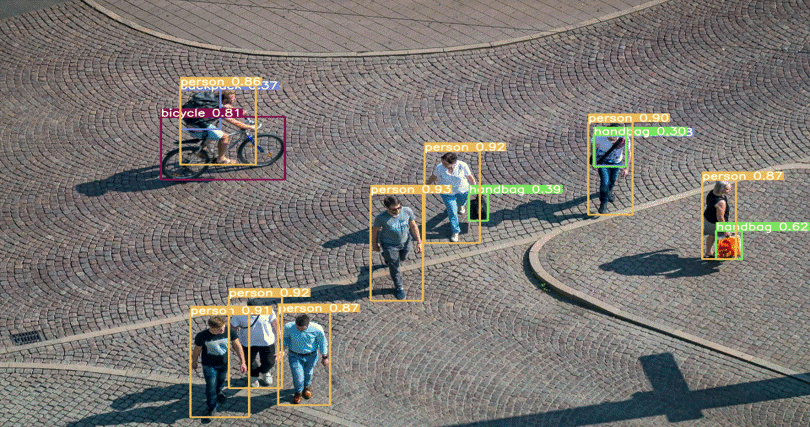
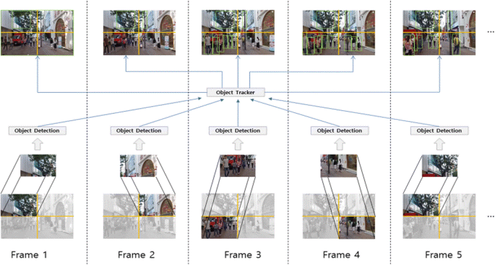
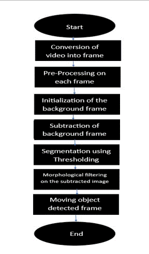
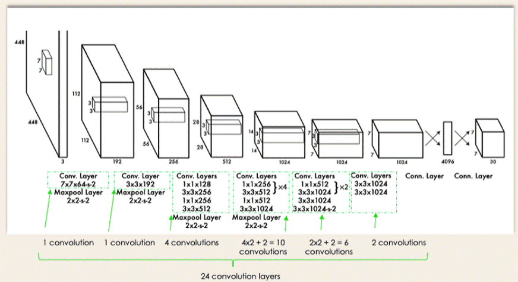

# RealTime-Object-Detection-Using-Yolo_v4

In the field of computer vision, my project focuses on developing a Real-Time Multi-Object Detection and Tracking system for video surveillance in dynamic environments. This technology has broad applications, including surveillance, medical imaging, vehicle navigation, and autonomous robotics. It’s particularly crucial for tackling issues related to terrorism, crime, and public safety. My project aims to improve traffic management efficiency by breaking down the surveillance process into three main tasks: detecting moving objects, tracking objects, and recognizing events. This work is in line with the growing demand for advanced visual monitoring solutions across various fields.

#### Reference Image

# OBJECTIVE OF THE PROJECT

The primary objective of this project is to pioneer the development and assessment of a cutting-edge algorithm designed for the efficient and precise real-time detection and tracking of multiple objects in video streams. This novel algorithm aims to surpass existing solutions by demonstrating superior accuracy and robustness across diverse video surveillance scenarios. Through rigorous evaluation, we seek to establish its applicability in addressing the challenges of contemporary surveillance needs. By pushing the boundaries of object detection and tracking, our project aspires to contribute a pioneering solution with broad implications for enhancing security and efficiency in real-world video monitoring applications.

# PROBLEM STATEMENT

Video surveillance is a crucial technology for ensuring security and safety in various domains, such as traffic management, public transportation, crime prevention, and disaster response. However, processing video streams from multiple cameras in real time poses significant challenges for computer vision algorithms, such as detecting and tracking multiple objects of interest, handling occlusions, shadows, illumination changes, and camera motion, and maintaining consistent identities of the tracked objects across different views. Therefore, there is a need for developing efficient and robust methods for real-time multi-object detection and tracking (MODT) for video surveillance applications. The main objectives of this report are to review the existing MODT methods, to propose a novel MODT framework that combines deep learning and correlation-based tracking, and to evaluate its performance on various video surveillance datasets.

# REQUIREMENT ANALYSIS 

### Functional Requirements
1. Real-Time Object Detection and Tracking - The system must adeptly detect and track multiple objects in real-time using a single-camera video stream.
2. Robust Handling of Challenges - It should effectively manage occlusions, shadows, illumination changes, and camera motion to ensure continuous and accurate tracking.
3. Consistent Object Identities - The system must maintain consistent identities for tracked objects across different views, ensuring reliable monitoring in dynamic environments.

### Non-Functional Requirements
1. Performance - The system should exhibit high-performance capabilities to ensure real-time responsiveness.
2. Scalability - It must be scalable to accommodate varying surveillance scenarios and system expansions.
3. User Interface - An intuitive user interface for ease of use and efficient monitoring by operators.

# DESIGN OF PROJECT

The procedural framework for achieving real-time multi-object detection and tracking encompasses a three-step approach. Initially, we utilize advanced background modeling techniques to establish a reference for the surroundings. Subsequently, motion segmentation is applied to distinguish dynamic elements from static backgrounds. The final step involves object classification for precise recognition. Foreground segmentation incorporates adaptive background subtraction, frame differencing, and an adaptive K foreground and background Gaussian mixture model. This systematic process is designed to improve surveillance capabilities, addressing various applications like entrance control, traffic monitoring, and security, while forming the basis for effective event recognition.

# LIMITATIONS

1. The potential for inaccuracies in object classification, especially in complex and dynamic environments
2. The effectiveness of foreground segmentation techniques, such as adaptive background subtraction and frame differencing, may be influenced by lighting variations and occlusions
3. The system's performance could be affected by the presence of noisy data or sudden environmental changes

# EVIDENCE OF PROBLEM-SOLVING

As we have discussed above, many research has been conducted to solve the above problem:

Criteria for handpicking leading research methods in the object tracking domain are based on five key metrics:-

* Leading conferences, (eg : CVPR, NeurIPS, ICCV, ICML, ECCV etc.
* Benchmark results on (e.g., MOT, Kitti, VOT, CVPR19 challenge)
* Publicly available code(by author/3rd party) supporting the results given in the paper.
* Citations
* Novel idea

# REAL-TIME USAGE

* Enhanced Security Measures
  * The project's real-time applications bolster security in various domains, providing       advanced tools for entrance control in special areas, optimizing traffic monitoring, and fortifying security in critical locations such as airports and banks.
* Public Safety and Military Operations
  * With a focus on real-time Object Detection, Tracking, and Event Recognition, the system proves indispensable in ensuring public safety and supporting military operations by promptly identifying and responding to potential threats.
* Urban Planning and Behavioral Analysis
  * Beyond security, the project contributes to urban planning efforts, utilizing advanced techniques like adaptive background subtraction. It also enables nuanced analysis of person behavior, providing valuable insights for urban development and public space management.

# YOLO Algorithm for Object Detection

* The YOLO algorithm, which stands for "You Only Look Once," revolutionized the realm of object detection with its distinctive approach. Unlike traditional methods involving multiple stages, such as region proposals followed by classification, YOLO accomplishes detection in a single forward pass of the network. By dividing an input image into a grid and predicting multiple bounding boxes and class probabilities simultaneously for each grid cell, the YOLO algorithm offers both speed and accuracy.
* "You Only Look Once," encapsulates its foundational idea: object detection should occur in a single forward pass through the neural network. This sharply contrasts with methods that separate object localization and classification into distinct stages.
* YOLO's strategy divides an image into a grid, and for each grid cell, it predicts multiple bounding boxes and their associated class probabilities simultaneously. This unified framework drastically reduces computational overhead, making real-time detection feasible without sacrificing accuracy.
* Compared to previous methods, YOLO's streamlined approach offers significant advantages. It reduces latency, making it apt for real-time applications, and its holistic view of the image ensures contextual understanding, reducing false positives. With YOLO's inception, the field witnessed a paradigm shift, emphasizing both efficiency and accuracy in object detection.

# References

[1]. Mohammad Javad Shafiee, Brendan Chwyl, Francis Li, Alexander Wong, Fast YOLO: A Fast You Only Look Once System for Real-time Embedded Object Detection in Video
[2]. Y. Meng, “Agent-based reconfigurable architecture for real-time object tracking,” Journal of Real-Time Image Processing, vol. 4, no. 4, pp. 339–351, 2009.
[3]. C. Tomasi and T. Kanade, “Shape and motion from image streams under orthography: a factorization method,” International 10)Journal of Computer Vision, vol. 9, no. 2, pp. 137–154, 1992.
[4]. Joseph Redmon, Santosh Divvala, Ross Girshick, Ali Farhadi You Only Look Once: Unified, Real-Time Object Detection. 
[5]. R. Zabih and J. Woodfill, “Non-parametric local transforms for computing visual correspondence,” in Computer Vision ECCV 94. Springer, 1994, pp. 151–158

